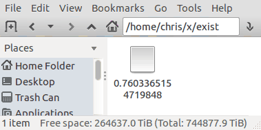

Have you ever wanted your files to exist purely at random?
==========================================================
Have you heard of quantum foam? Virtual particles? Do you want your files to be
more like that?
Have you ever thought to yourself,
"gee, I wish my files' existence was less reliable"?

...No? How about now?

With our revolutionary new filesystem, you can't store data. In fact, there's
even a pretty good chance that anything resembling a `ls` invocation will
trigger a [TOCTTOU](https://en.wikipedia.org/wiki/Time_of_check_to_time_of_use)
race condition. Neat, huh!

Seriously, what's it good for?
------------------------------
Mostly this was a first step to familiarize myself with [FUSE](https://en.wikipedia.org/wiki/Filesystem_in_Userspace) (filesystem in userspace).

Such an unpredictable filesystem is useful for robustness-testing of anything
that deals with files. How much does your application's security rely on sane
information from the (imperfect, corruptible) filesystem it relies on?
PCManFM, for example, handles edge-cases quite well:

Caching behavior can also be quickly investigated with a filesystem this shifty:

    $ /usr/bin/[ -e 0.5 ] && echo "heads" || echo "tails"
    heads
    $ /usr/bin/[ -e 0.5 ] && echo "heads" || echo "tails"
    tails
    $ /usr/bin/[ -e 0.5 ] && echo "heads" || echo "tails"
    tails
    $ /usr/bin/[ -e 0.5 ] && echo "heads" || echo "tails"
    tails
    $ /usr/bin/[ -e 0.5 ] && echo "heads" || echo "tails"
    tails
    $ /usr/bin/[ -e 0.5 ] && echo "heads" || echo "tails"
    tails
    (etc)

